# StudyPal — Personalized AI Learning Assistant

[](https://reactjs.org/)
[](https://nodejs.org/)
[](https://www.mongodb.com/)
[](https://tailwindcss.com/)

> **StudyPal** is a high-performance, full-stack learning ecosystem that leverages AI to turn static documents into dynamic, interactive study tools. Built with a focus on **Premium DX (Developer Experience)**.

<div align="center">
  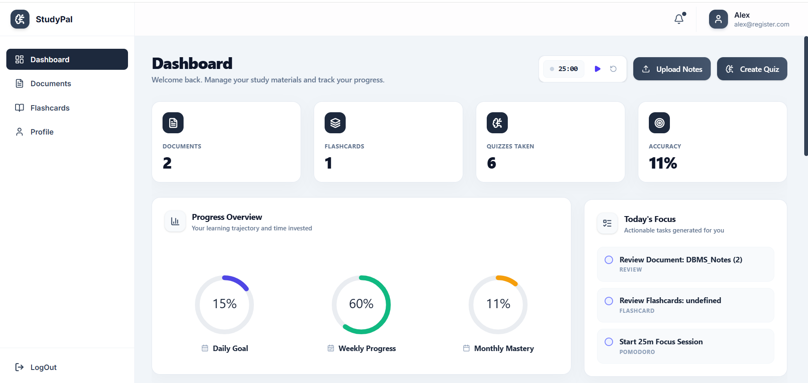
</div>

---

## Key Features

### AI-Driven Intelligence
- **Automated Knowledge Synthesis:** Leverages Gemini AI to parse complex PDFs/text and generate high-yield Quizzes and Flashcards.
- **Contextual Feedback Loops:** AI doesn't just grade; it provides meaningful explanations for every incorrect answer, fostering a true learning environment.
- **Dynamic Content Generation:** Real-time generation of study materials using optimized prompt engineering.

### Engineering & UI/UX Excellence
- **Modern Design System:** A meticulously crafted UI using a custom Tailwind configuration, featuring 16px border-radii, glassmorphism, and fluid animations.
- **Global Interaction Hooks:** Custom CSS keyframes and Framer-inspired transitions ensure every page change feels professional and polished.
- **Universal Responsiveness:** Engineered for a "perfect" mobile experience (320px+) with zero horizontal overflow and intelligent content wrapping.

### Productivity Suite
- **Embedded Focus Engine:** Integrated Pomodoro timer in the dashboard with persistence and live updates.
- **Consistency Visualization:** GitHub-inspired activity heatmaps and real-time progress analytics (Circular Progress, Bar Charts).

---

## 📸 Platform Showcase

<table align="center">
  <tr>
    <td align="center"><b>Intelligent Document Parsing</b><br>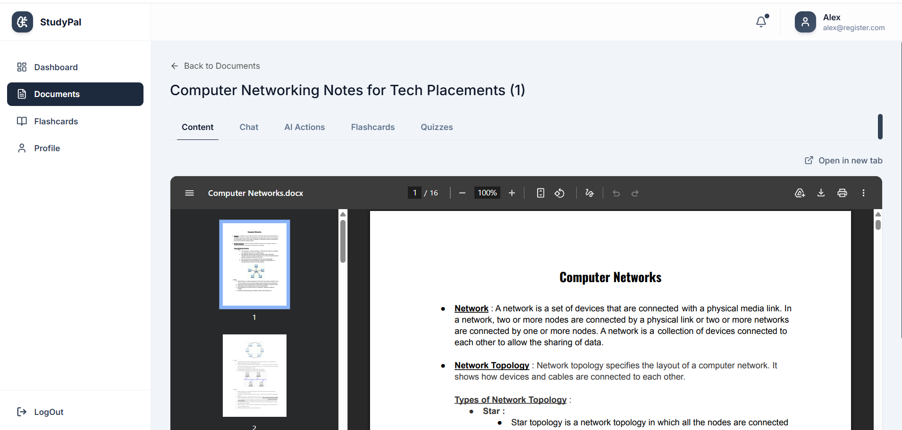</td>
    <td align="center"><b>Interactive AI Chat</b><br>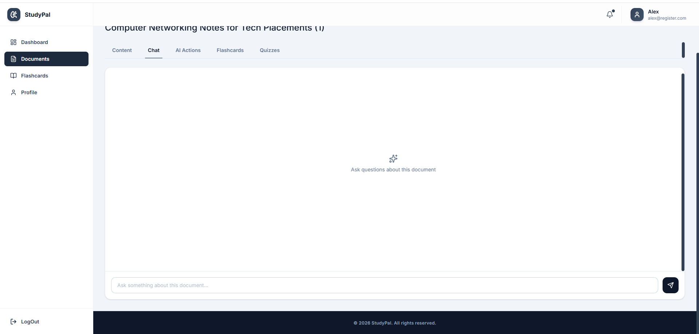</td>
    <td align="center"><b>AI Capabilities</b><br>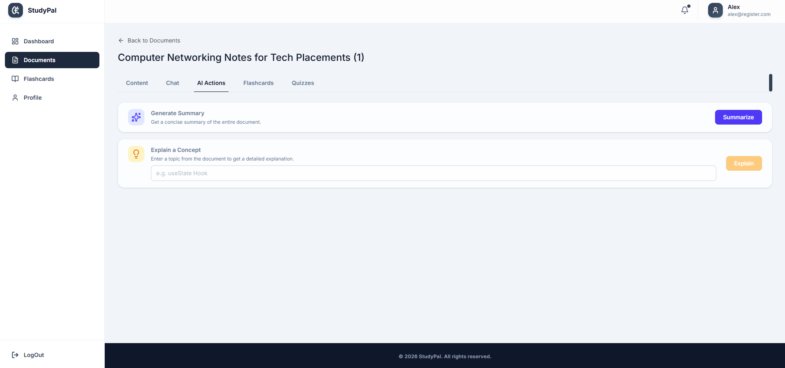</td>
  </tr>
  <tr>
    <td align="center"><b>Smart Flashcards</b><br>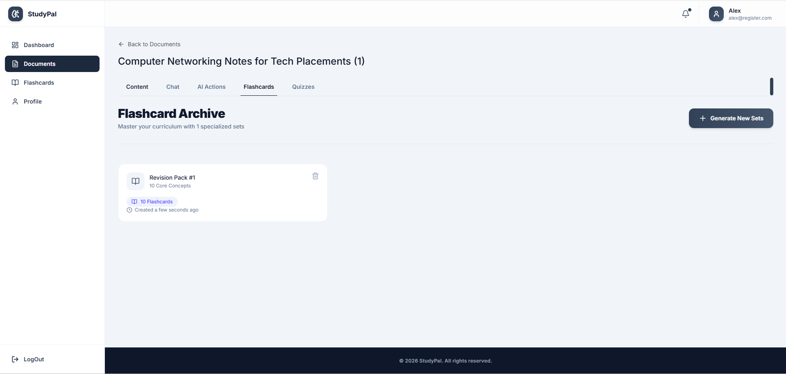</td>
    <td align="center"><b>Flashcard Review</b><br>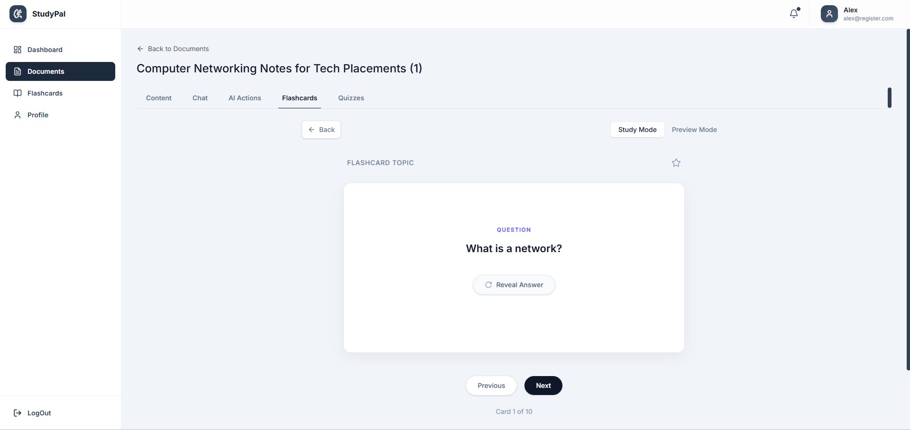</td>
    <td align="center"><b>Repetition Tracking</b><br>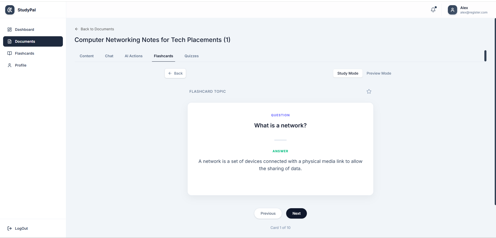</td>
  </tr>
  <tr>
    <td align="center"><b>AI Generated Quizzes</b><br>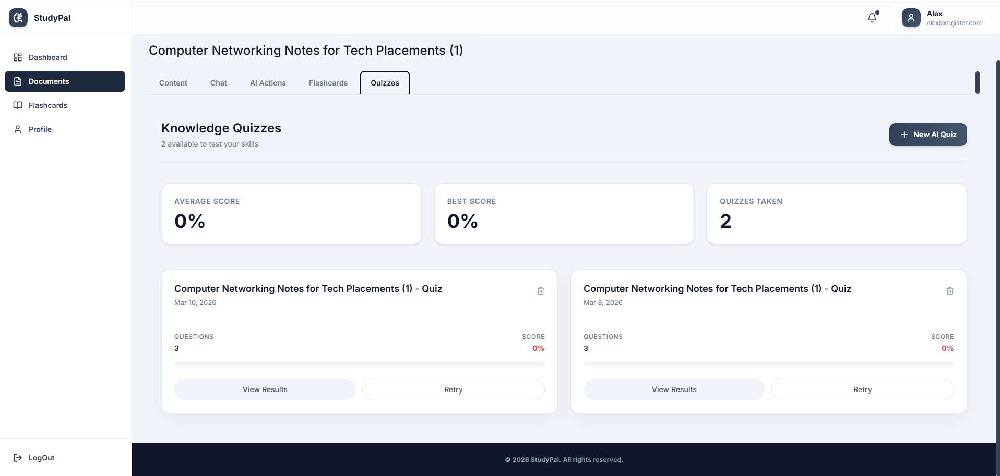</td>
    <td align="center"><b>Quiz Results</b><br>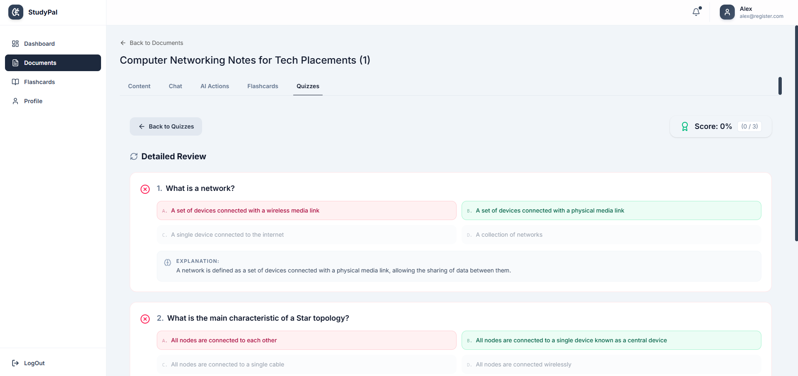</td>
    <td align="center"><b>Sleek Dark Mode</b><br>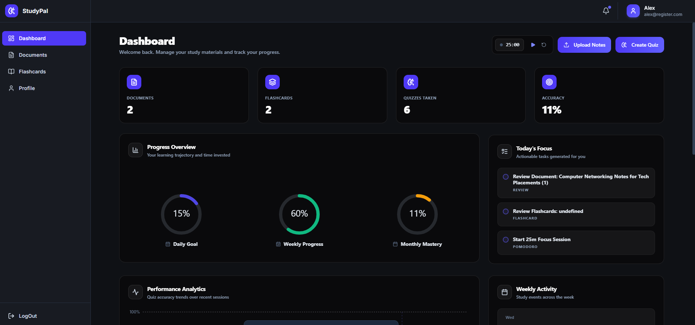</td>
  </tr>
  <tr>
    <td align="center"><b>Dashboard Focus</b><br>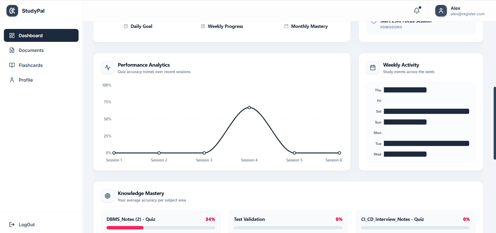</td>
    <td align="center"><b>Dashboard Hub</b><br>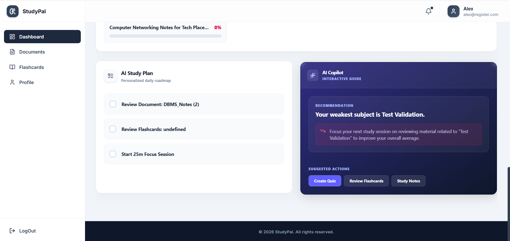</td>
    <td align="center"><b>Secure Login</b><br>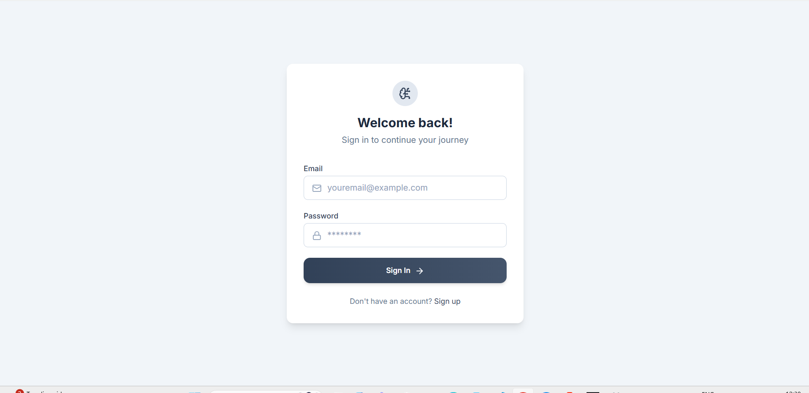</td>
  </tr>
  <tr>
    <td align="center"><b>Detailed Analytics</b><br>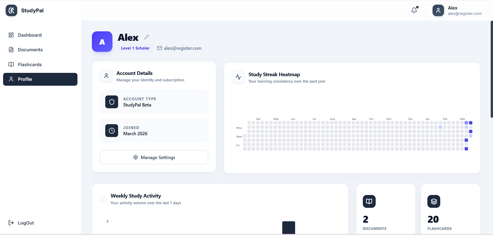</td>
    <td align="center"><b>Profile Settings</b><br>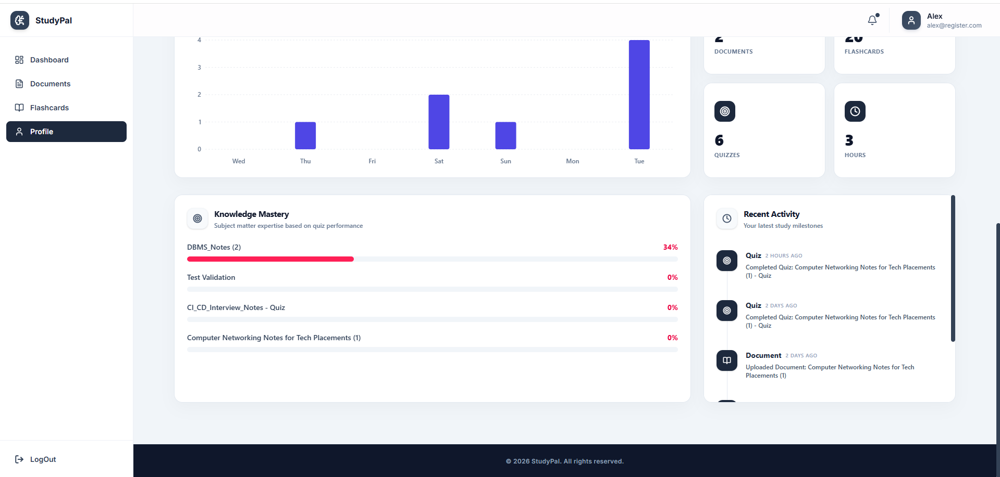</td>
    <td align="center"><b>Learning History</b><br>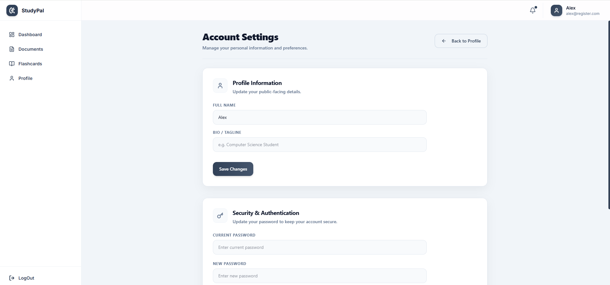</td>
  </tr>
</table>

---

## Technical Highlights & Architecture

### Secure & Scalable Backend
- **RESTful API Design:** Cleanly partitioned controllers, services, and models for high maintainability.
- **JWT-Based Authentication:** Stateless session management with secure token-based verification.
- **Mongoose Middleware:** Complex data validation and pre-save hooks for data integrity.

### Advanced Frontend Patterns
- **Standardized Component Library:** Reusable, accessible UI primitives (Buttons, Modals, Spinners) built from the ground up.
- **Context API State Management:** Centralized Auth and Global App settings for predictable state transitions.
- **Premium Layout System:** A robust `AppLayout` wrapper managing global page transitions (`fade-in`, `slide-up`) and consistent navigation.

### Performance & Optimization
- **Layout Shift Prevention:** Standardized aspect ratios and skeleton loading principles.
- **Global CSS Utility:** Shared `.premium-card` and `.btn-interaction` classes to reduce CSS bloat.
- **Asset Optimization:** Minimal SVG assets and system-level font stacks for lightning-fast First Contentful Paint (FCP).

---

## Project Structure

```text
StudyPal/
├── backend/                # Node/Express API
│   ├── config/             # Database & environment config
│   ├── controllers/        # Business logic
│   ├── middleware/         # Custom Express middleware
│   ├── models/             # Mongoose schemas
│   ├── routes/             # API endpoints
│   ├── services/           # AI Logic & external API wrappers
│   └── server.js           # Server entry point
├── frontend/StudyPal/      # React/Vite Client
│   ├── src/
│   │   ├── components/     # Reusable UI Primitives
│   │   ├── pages/          # Full page views
│   │   └── ...
│   ├── public/             # Static assets
│   └── index.html          # HTML entry point
├── Screenshots/            # Project documentation images
└── README.md               # Technical Documentation
```

---

## Tech Stack

| Layer | Technologies |
| :--- | :--- |
| **Frontend** | React 18, Tailwind CSS v4, Lucide Icons, Recharts |
| **Backend** | Node.js, Express.js |
| **Database** | MongoDB (Mongoose ODM) |
| **AI Hub** | Google Gemini API (via AI Service Layer) |
| **Auth** | JSON Web Tokens (JWT) |

---

## Engineering Challenges & Solutions

### 1. Handling Large-Scale Document Parsing
**Challenge:** Generating high-quality quizzes from long, unstructured PDF text without hitting token limits or losing context.
**Solution:** Implemented a sophisticated prompt engineering layer that chunks text into thematic modules before synthesizing them through the Gemini AI service.

### 2. Perfecting the Mobile Experience
**Challenge:** Horizontal scrolling and layout jitter on 320px screens due to fixed-width assets.
**Solution:** Removed redundant page padding in favor of a global layout-level spacing strategy, combined with dynamic CSS visibility triggers to hide non-essential text on ultra-compact displays.

---

## Getting Started

### Prerequisites
- **Node.js** (v18+)
- **MongoDB** (Local or Cloud Atlas)
- **API Keys:** Google Gemini API Key

### Installation & Quick Start

1. **Clone & Explore**
   ```bash
   git clone https://github.com/virendrasuryawanshi09/StudyPal.git
   cd StudyPal
   ```

2. **Server Setup**
   - Head to `/backend`
   - `npm install`
   - Configure `.env` (PORT, MONGO_URI, JWT_SECRET, GEMINI_API_KEY)
   - `npm start`

3. **Frontend Setup**
   - Head to `/frontend/StudyPal`
   - `npm install`
   - `npm run dev`

---

## Contributing
I welcome contributions that enhance StudyPal's feature set or technical performance. 
1. Fork the Project
2. Create your Feature Branch (`git checkout -b feature/AmazingFeature`)
3. Commit your Changes (`git commit -m 'Add: AmazingFeature'`)
4. Push to the Branch (`git push origin feature/AmazingFeature`)
5. Open a Pull Request

---

## Developed by Virendra Suryawanshi

- **GitHub:** [@virendrasuryawanshi09](https://github.com/virendrasuryawanshi09)
- **LinkedIn:** [Virendra Suryawanshi](https://github.com/virendrasuryawanshi09) *(Replace with actual link)*

*This project is a testament to my commitment to clean code, user-centric design, and the effective integration of AI in modern web applications. If you're looking for a developer who builds with purpose and precision, let's connect.*


